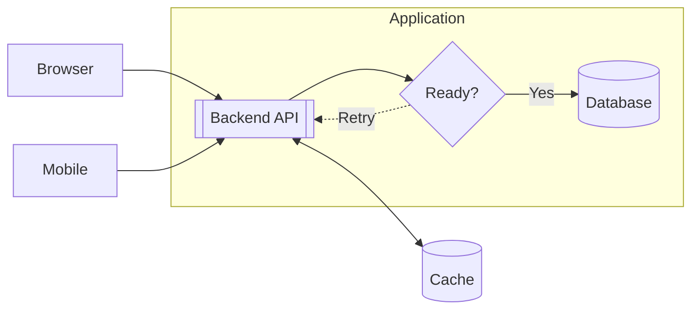
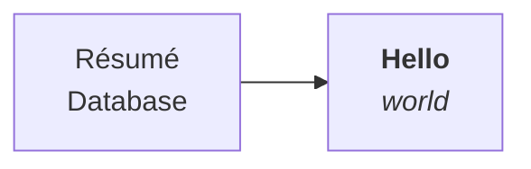
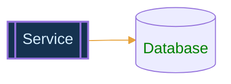
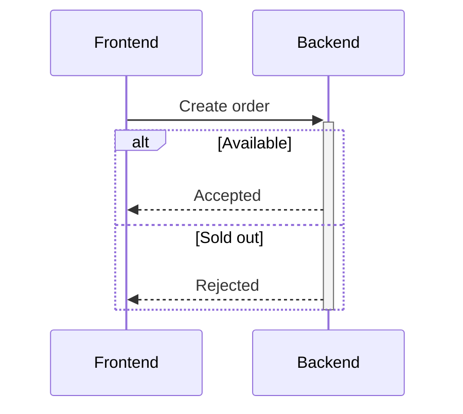

# termaid

Render Mermaid diagrams directly in a terminal as selectable text. Supports
flowcharts, sequence diagrams, basic state diagrams, and Mermaid blocks in
Markdown. Written in Rust with no external dependencies, browser, or image protocol.

With `termaid` installed:

```sh
termaid examples/web-app.mmd
termaid examples/sequence.mmd
termaid examples/state.mmd
termaid --color examples/flowchart-features.mmd
termaid examples/diagrams.md
```

## Build and install

Requires Rust 1.85 or newer. From the project directory:

```sh
cargo install --path . --offline
```

This builds an optimized binary and installs it in Cargo's bin directory, normally
`~/.cargo/bin`. Make sure that directory is on your `PATH`, then check:

```sh
termaid --version
```

To build without installing:

```sh
cargo build --release --offline
./target/release/termaid examples/web-app.mmd
```

The code uses portable Rust APIs and is intended for Linux and macOS. It has been
built and tested on Linux; macOS still needs a native test run.

## Usage

```sh
termaid diagram.mmd
cat diagram.mmd | termaid
termaid --ascii diagram.mmd
termaid --format unicode diagram.mmd
termaid --color diagram.mmd
termaid README.md
cat notes.md | termaid --markdown
termaid diagram.mmd > diagram.txt
termaid examples/flowchart-features.mmd | less -S
```

No filename, or `-`, reads standard input. Running interactively without input
shows help. Use `--` before a filename beginning with a dash.

Unicode drawing characters are the default. `--ascii` changes the drawing
characters; it preserves Unicode text in labels. Use a monospace font. Diagrams
retain their full width; `less -S` provides horizontal scrolling.

Output is plain text by default. `--color` explicitly enables ANSI truecolor
styling; `--no-color` disables it. Redirected output is also plain unless
`--color` is requested. Errors go to stderr with a nonzero exit code, and no
partial diagram is written.

Markdown files ending in `.md` or `.markdown` are read as documents. Mermaid
fences in piped input are detected automatically, or can be selected with
`--markdown`. Backtick and tilde fences are supported; other code blocks and
prose are skipped. Multiple diagrams are rendered in document order, separated
by a blank line. An invalid block fails the whole document and identifies the
block number.

## Flowcharts

Use `graph` or `flowchart` with `TD`, `TB`, `BT`, `LR`, or `RL`. Separate the
header and statements with newlines or semicolons. `%%` starts a comment outside
labels. Node IDs may contain letters, numbers, underscores, and hyphens.



Supported features:

- Nested `subgraph` / `end` groups, optional titles, and group-local `direction`.
- Cycles, self-loops, branches, merges, disconnected nodes, and skip-level edges.
- Directed `-->`, unarrowed `---`, dotted `-.->` / `-.-`, and thick `==>` / `===` edges.
- Bidirectional `<-->`, `<-.->`, `<==>`, circle `o--o` / `---o`, and cross
  `x--x` / `---x` endpoints.
- Chains, `A & B --> C & D`, pipe labels `-->|Yes|`, and inline labels
  `-- Yes -->`, `-. Retry .->`, and `== Go ==>`.
- Repeated references; later explicit labels or shapes update existing nodes.
- Classic shape syntax and modern `A@{ shape: cyl, label: "Database" }` syntax.

| Shape | Classic syntax | Modern shape name |
| --- | --- | --- |
| Rectangle | `A[Label]` | `rect` |
| Rounded rectangle | `A(Label)` | `rounded` |
| Diamond | `A{Question?}` | `diamond` |
| Cylinder | `A[(Database)]` | `cyl` |
| Double-bordered service | `A[[Service]]` | `subproc` |
| Circle | `A((Start))` | `circle` |
| Double circle | `A(((End)))` | `dbl-circ` |
| Stadium | `A([Start])` | `stadium` |
| Hexagon | `A{{Prepare}}` | `hex` |
| Parallelogram | `A[/Input/]` | `lean-r` |
| Reverse parallelogram | `A[\Output\]` | `lean-l` |

Shapes are terminal approximations. Circles and stadiums use oval outlines;
subroutines use full double borders. Diamonds grow with their labels, so short
questions keep them compact. Arrows connect at the sides appropriate to the
flow direction.

### Labels

Labels support accented characters, combining accents, CJK wide characters, and
single-code-point emoji. Layout uses terminal display columns rather than bytes.
Complex emoji presentation, skin-tone, and joiner sequences are rejected;
terminal fonts and complex script shaping can still affect alignment.

Use quoted labels for punctuation, shape delimiters, and multiline text:



`<br>`, `<br/>`, and `<br />` become line breaks. Common HTML entities
(`&amp;`, `&lt;`, `&gt;`, `&quot;`, `&apos;`, `&nbsp;`) are decoded. Mermaid Markdown
strings preserve their text and line breaks while removing basic bold/italic
markers. Other HTML and full Markdown formatting are not supported. Control
characters and Unicode formatting controls are rejected.

### Styling

`classDef`, `class`, inline `:::className`, `style`, and `linkStyle` are supported
for nodes and edges. Enable their terminal colors with `--color`:



Supported properties are `fill`, `color`, `stroke`, `stroke-width`, and
`font-weight:bold`. Use `#RGB`, `#RRGGBB`, or common named colors. Fill maps to a
terminal background; color/stroke map to foreground; thicker strokes map to bold.
A `color` property takes precedence over `stroke` within one declaration.
`classDef default` and `linkStyle default` provide defaults. Explicit node styles
apply after classes. Edge indexes are zero-based and follow expanded edge order.
Unsupported style properties produce an error, even with colors disabled.

## Sequence diagrams



Supported: participants and aliases, actors shown as labeled boxes, implicit
participants, solid/dashed messages, cross endpoints, messages to self, notes
`over` / `left of` / `right of`, `activate` / `deactivate`, `+` / `-` message
activation shortcuts, and `autonumber`. Nested `alt` / `else`, `opt`, `loop`,
`par` / `and`, `critical` / `option`, and `break` fragments have labeled frames.
Open and filled arrowheads are represented by the same terminal arrow; activation
nesting is tracked but displayed as a single emphasized lifeline.

Participant grouping, creation/destruction, custom numbering parameters, links,
sequence styling, and other advanced sequence syntax are not supported yet.

## State diagrams

Basic `stateDiagram` and `stateDiagram-v2` diagrams support transitions,
transition labels, `[*]` initial/final states, cycles, `direction`,
`state "Description" as ID`, and `ID: Description`. They use the flowchart layout
engine. Composite/concurrent states, notes, and specialized state pseudonodes are
not supported yet.

## Examples

| File | Demonstrates |
| --- | --- |
| [examples/pipeline.mmd](examples/pipeline.mmd) | Minimal left-to-right flow |
| [examples/decision.mmd](examples/decision.mmd) | Decision and labeled branches |
| [examples/shapes.mmd](examples/shapes.mmd) | Original shape showcase |
| [examples/web-app.mmd](examples/web-app.mmd) | Frontend, backend, services, stores, and payments |
| [examples/flowchart-features.mmd](examples/flowchart-features.mmd) | Nested groups, cycles, arrows, Unicode, and styles |
| [examples/sequence.mmd](examples/sequence.mmd) | Checkout messages, notes, activations, and fragments |
| [examples/state.mmd](examples/state.mmd) | Order states with a retry cycle |
| [examples/diagrams.md](examples/diagrams.md) | Multiple diagrams in Markdown |
| [examples/architecture.mmd](examples/architecture.mmd) | The app's rendering architecture |

Checked-in `.txt` previews accompany the architecture and web-app examples.

## Remaining limits

This is a subset of Mermaid, not a drop-in implementation of every grammar.
Class, ER, Gantt, and other diagram families are not yet supported. Flowcharts do
not support edges directly to subgraph IDs, group styling, arbitrary CSS, every
arrow spelling, all modern shape attributes, or every shape. Connect to nodes
inside groups instead. Mermaid initialization directives are comments to this
renderer; themes and browser configuration are not applied. Mermaid YAML
frontmatter is not supported.

Input is limited to 64 KiB. Labels allow 60 display columns and 8 lines. Flowcharts
allow 60 nodes, 200 edges, and 16 groups; sequence diagrams allow 20 participants,
200 events, and 8 nested fragments. All renderers limit the canvas to 120,000 cells.
Dense graphs may have crossings or shared connector segments; this layout does
not minimize crossings. A diagram that cannot fit its routes or labels returns
an error. There is no automatic terminal-width fitting or interactive navigation.

## Architecture and development

- `src/main.rs`: CLI options, bounded file/stdin input, stdout, and errors.
- `src/lib.rs`: public rendering API and diagram dispatch.
- `src/markdown.rs`: fenced diagram extraction.
- `src/parser.rs`: flowchart syntax, groups, arrows, and style assignments.
- `src/layout.rs`: recursive group layout and cycle-tolerant graph ranking.
- `src/canvas.rs`: connector routing, labels, group boundaries, and terminal output.
- `src/shapes.rs`: shape dimensions and outlines.
- `src/text.rs`, `src/unicode_widths.rs`: label normalization and display widths.
- `src/style.rs`: supported style properties and ANSI color generation.
- `src/sequence.rs`: sequence parsing and lifeline/frame rendering.
- `src/state.rs`: basic state-to-graph translation.

The library exposes `render(source, ascii)`, `render_with_options(source, options)`,
and `render_markdown(source, options)`. Rendering completes before any CLI output
is written. Unicode width tables are checked in; `tools/generate_widths.py`
regenerates them using Python's bundled Unicode database, with its version recorded
in the generated file. Python is not required to build or run the app.

For Python maintenance tasks, use `uv`, for example:

```sh
uv run python tools/generate_widths.py
```

```sh
cargo test --offline
cargo fmt --check
cargo clippy --offline --all-targets -- -D warnings
```

Tests cover snapshots, shape geometry, all directions, groups, cycles, shorthand,
Unicode labels, styles, Markdown extraction, sequence/state diagrams, malformed
input, resource limits, and CLI behavior.
