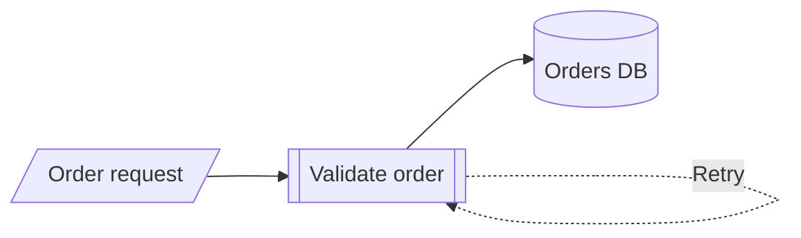
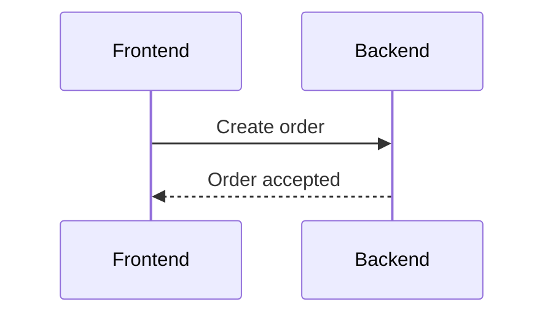

# Order processing

This Markdown example contains two independently rendered Mermaid diagrams.

```mermaid
flowchart LR
    Input[/Order request/] --> Process[[Validate order]]
    Process --> DB[(Orders DB)]
    Process -. Retry .-> Process
```

```mermaid
sequenceDiagram
    participant UI as Frontend
    participant API as Backend
    UI->>API: Create order
    API-->>UI: Order accepted
```
